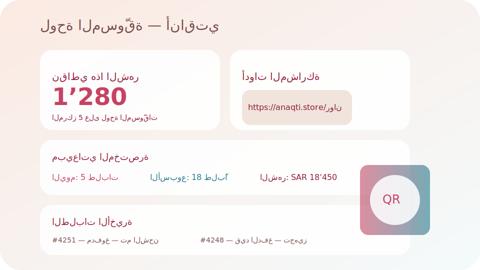

# Atlantis E-commerce Platform

## 🚀 Project Overview

**Lovable Project URL**: https://lovable.dev/projects/bcb1c4b5-98be-4432-b045-2bf9a24e6860

An integrated e-commerce system with affiliate marketing and multi-store support built with React, TypeScript, and Supabase.

## 🛠️ Local Development Setup

### Prerequisites
- Node.js 18+ ([install with nvm](https://github.com/nvm-sh/nvm#installing-and-updating))
- npm or yarn

### Quick Start

```bash
# 1. Clone the repository
git clone <YOUR_GIT_URL>
cd <YOUR_PROJECT_NAME>

# 2. Install dependencies
npm install

# 3. Setup environment variables (for local development only)
cp .env.example .env
# Edit .env and add your Supabase credentials

# 4. Start development server
npm run dev
```

### 🔐 Environment Variables

**⚠️ IMPORTANT SECURITY NOTES:**
- **NEVER** commit `.env` files to git
- Use `.env.example` as a template
- In production, use Supabase Secrets instead of `.env` files

For local development outside of Lovable:
1. Copy `.env.example` to `.env`
2. Fill in your Supabase project URL and anon key
3. Get these values from your Supabase dashboard

#### Feature Flags & Inventory Defaults

- `USE_ECOMMERCE_FLOW=true` &mdash; enables the ecommerce order pipeline (required for the unified checkout and analytics flows).
- `DEFAULT_WAREHOUSE_CODE=MAIN` &mdash; fallback warehouse code consumed by the internal inventory triggers.

### 📝 Available Scripts

```bash
npm run dev      # Start development server
npm run build    # Build for production
npm run preview  # Preview production build
npm run lint     # Run ESLint
```

## 🗃️ Database Policies & Indexes

The row-level security policies and supporting indexes live under `sql/01_policies.sql` and `sql/02_indexes.sql`. Apply them to your Supabase project in one of the following ways:

1. **Supabase CLI** (with `supabase link` or `SUPABASE_DB_URL` configured):
   ```bash
   supabase db execute --file sql/01_policies.sql
   supabase db execute --file sql/02_indexes.sql
   ```
2. **Supabase Dashboard**: copy the contents of each file into the SQL editor and run them sequentially.

These policies assume that `auth.uid()` corresponds to `profiles.auth_user_id`, so ensure every authenticated user has a linked profile record before testing access.

## 💸 Commissions Pipeline

Payment completion is now wired to the affiliate payouts workflow that lives in `sql/03_commissions_pipeline.sql`. Apply it after the policies/indexes scripts so the following automation is available:

- Payment transactions that reach `COMPLETED` automatically mark the parent order as `PAID`.
- As soon as an order flips to `PAID`, commissions are upserted per order item using the rate priority chain of `ecommerce_order_items.commission_rate → products.commission_rate → merchants.default_commission_rate`.
- The order’s `affiliate_commission_sar` column is refreshed to the sum of its commission rows, keeping dashboards in sync.

Run the script via Supabase CLI or the dashboard exactly like the previous ones:

```bash
supabase db execute --file sql/03_commissions_pipeline.sql
```

The pipeline assumes each affiliate order is tied back to an `affiliate_stores.profile_id`, so every affiliate-facing store needs an associated profile record for commissions to resolve correctly.

## 🏆 Points & Monthly Leaderboard

Paid orders now emit gamified point events that plug into the monthly leaderboard. Apply `sql/04_points_leaderboard.sql` after the commissions script to wire the trigger, idempotent point inserts, and both alliance and individual leaderboard views:

```bash
supabase db execute --file sql/04_points_leaderboard.sql
```

Once deployed, every order that transitions to `PAID` grants:

- `order_success` (+10 نقاط) على مستوى الطلب.
- `item_sold` (+3 نقاط) لكل عنصر في الطلب.
- `new_customer_signup` (+15 نقاط) لأول عميل جديد يجلبه رابط المسوّق لنفس المتجر.

The new `/leaderboard` page (protected behind authentication) surfaces the top alliances first and automatically falls back to the individual leaderboard when alliances are not configured. The companion API helpers in `src/server/leaderboard/api.ts` require an authenticated session before exposing leaderboard or “my points” data.

## 🎯 Minimal Affiliate Dashboard



The `/affiliate` route now renders a lightweight dashboard designed specifically for affiliates:

- **MyScoreCard** surfaces this month’s points and current leaderboard rank using the protected `getMyMonthlyPoints` helper.
- **MySalesGlance** aggregates today/week/month orders, items, and revenue directly from the ecommerce tables with 60-second caching.
- **RecentOrders** lists the latest ten affiliate-store orders with instant payment/fulfillment filters.
- **ShareTools** provides one-click copying, QR-code generation (via canvas), and Web Share API shortcuts for the store link.

Access is limited to authenticated affiliates (with admins allowed through impersonation). Non-authorized visitors are shown a guarded message instead of raw data.

## 📦 Internal Inventory

The Zoho integration has been fully deprecated in favor of the internal warehouse tables. Run `sql/05_internal_inventory.sql` to connect order creation and payment events to the new reservation workflow:

```bash
supabase db execute --file sql/05_internal_inventory.sql
```

Once applied, the database will automatically:

- Reserve inventory rows (`inventory_reservations`) every time order items are inserted.
- Convert active reservations into `OUT` movements when an order’s payment status reaches `PAID`.
- Release reservations and return availability when payments transition to `CANCELLED` or `FAILED`.

Ensure `DEFAULT_WAREHOUSE_CODE` is configured (defaults to `MAIN`) so orders without explicit warehouse assignments can still reserve stock from the intended location.

## 🔄 Development Workflow

### Using Lovable (Recommended)
Simply visit the [Lovable Project](https://lovable.dev/projects/bcb1c4b5-98be-4432-b045-2bf9a24e6860) and start prompting. Changes are automatically committed to this repo.

### Using Local IDE
All changes pushed to this repo will automatically sync to Lovable.

### Branch & PR Workflow
```bash
# Create feature branch
git checkout -b feature/your-feature-name

# Make changes and commit
git add .
git commit -m "feat: your feature description"

# Push and create PR
git push origin feature/your-feature-name
```

### GitHub Integration
- **Direct GitHub Editing**: Edit files directly on GitHub
- **Codespaces**: Use GitHub Codespaces for cloud development
- **Automatic Sync**: All changes sync bidirectionally with Lovable

## What technologies are used for this project?

This project is built with:

- Vite
- TypeScript
- React
- shadcn-ui
- Tailwind CSS

## How can I deploy this project?

Simply open [Lovable](https://lovable.dev/projects/bcb1c4b5-98be-4432-b045-2bf9a24e6860) and click on Share -> Publish.

## Can I connect a custom domain to my Lovable project?

Yes, you can!

To connect a domain, navigate to Project > Settings > Domains and click Connect Domain.

Read more here: [Setting up a custom domain](https://docs.lovable.dev/tips-tricks/custom-domain#step-by-step-guide)
